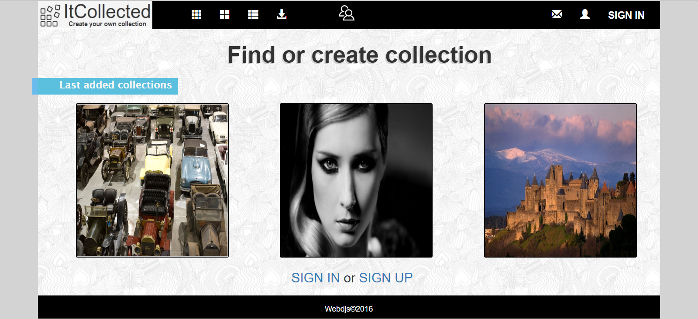

## MEAN Stack, Single-page Аpplication with Angular

# ItCollected - create your own collection

## It use:
- MongoDB + mongojs
- Express + body-parser
- Angular2 + systemjs
- Node.js

### To run this app:
- install [Node.js](https://nodejs.org/en/)
- open cmd:
> node install npm
- open cmd in ItCollected directory
- to install node modules:
> npm install
- to run this app:
> npm start
